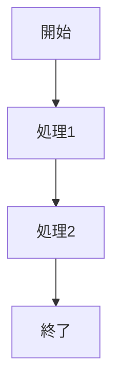

# Code Explainer

## 目的

指定されたコードファイルを読み込み、以下を生成する：

1. コードの概要説明（何をしているか）
2. 処理フローの Mermaid ダイアグラム
3. 重要なポイントの箇条書き

## 出力形式

### 概要
（コードの役割を 1-2 文で説明）

### 処理フロー

### 重要ポイント
- ポイント 1
- ポイント 2
- ポイント 3
